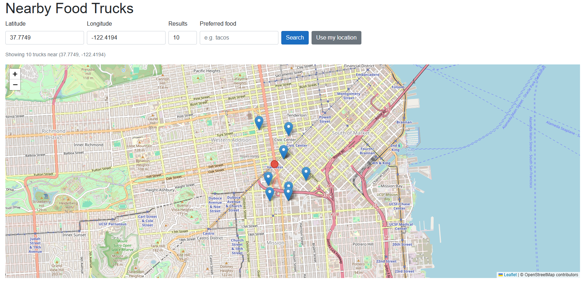

# FoodTruckSearch

A Blazor WebAssembly app for searching nearby food trucks on an interactive map, hosted on Heroku.



## Project Structure

```
FoodTruckSearchApp/
├── FoodTruckSearchApp.sln
└── src/
    ├── Client/                          # FoodTruckSearch.Client — Blazor WASM
    │   ├── Layout/                      # NavMenu, MainLayout
    │   ├── Pages/                       # Home.razor (map), Trucks.razor (table)
    │   ├── Services/                    # TruckService — CSV loading & search
    │   └── wwwroot/                     # Static assets, sample data
    ├── Server/                          # FoodTruckSearch.Server — ASP.NET Core host
    │   └── Program.cs                   # Serves the Blazor WASM output
    └── Shared/                          # FoodTruckSearch.Shared — shared models
        └── Models/
            ├── Truck.cs
            └── TruckSearchResult.cs
```

## Build & Run

### Local development

```bash
dotnet run --project src/Server
```

Then open `http://localhost:61469` (or the URL shown in the terminal).

### Build

```bash
dotnet build FoodTruckSearchApp.sln
```

### Publish

```bash
dotnet publish src/Server -c Release -o out
```
